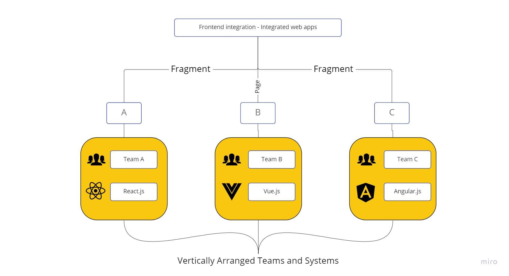
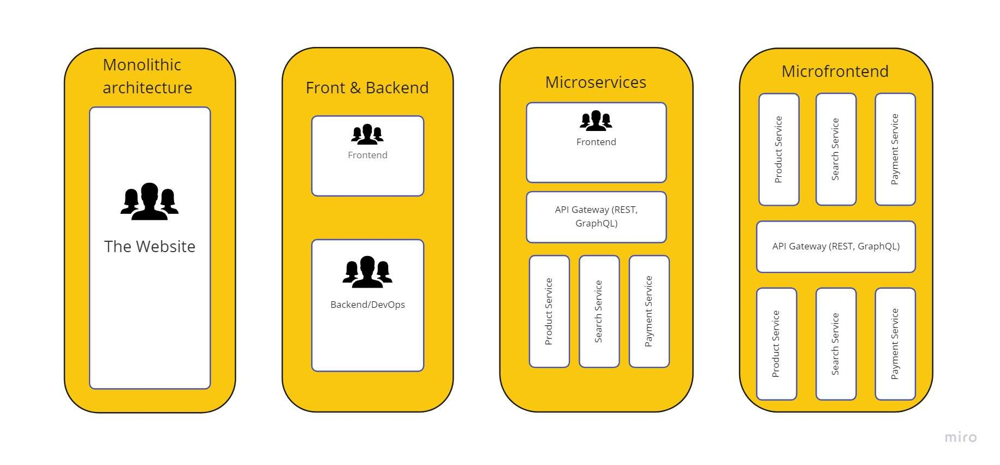

# 마이크로 프론트엔드란?

# 1. 특징

마이크로서비스 아키텍쳐를 프론트엔드에도 적용시킨 것으로
규모가 큰 프론트엔드를 여러 작은 독립적인 모듈로 분할합니다.

1. 독립적인 개발 및 배포:각 마이크로 프론트엔드는 독립적으로 개발되고 배포됩니다.이를 통해 개발 팀은 서로 영향을 주지않고 작업할 수 있습니다.
2. 기술 스택의 자유:마이크로 프론트엔드는 서로 다른 기술 스택을 사용할 수 있으므로,팀은 각자 필요에 맞는 생산 툴을 선택할 수 있습니다.
3. 재사용 가능한 구성 요소:공통 요소(layout, etc …)를 재사용 가능한 구성 요소로 만들어 두면,다양한 마이크로 프론트엔드에서 사용할 수 있습니다.

# 2. 장점

## 2.1 개발 팀 간의 협업 향상

## 2.2 빠른 출시 및 반복

## 2.3 유연한 기술 선택

# 3. 단점

## 3.1 복잡성 증가

## 3.2 성능 이슈

## 3.3 일관된 사용자 경험 유지 어려움
